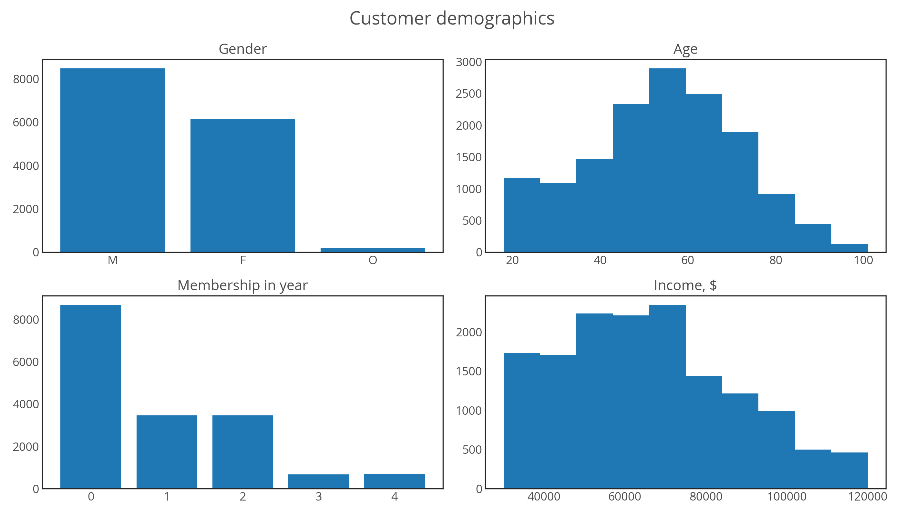

# Starbucks-Promotion-Recommender
analyze simulated data to assess promotion influence on customer and a recommender system based on similar users and the user history preference

# library:
- `pandas`
- `numpy`
- `matplotlib` + `seaborn`

# Data description:
- three json files created by Starbucks. Noted that this is *simulated* data.
- `portfolio.json`: information about offer such as type, difficulty, rewards, valid period
- `profile.json`: user information such as age, income, gender, become membership since

# Data Exploration and Analysis
- Please follow the `Jupyter Notebook` to examine or practice
- counting and distribution of variables in `profile.json`

  

