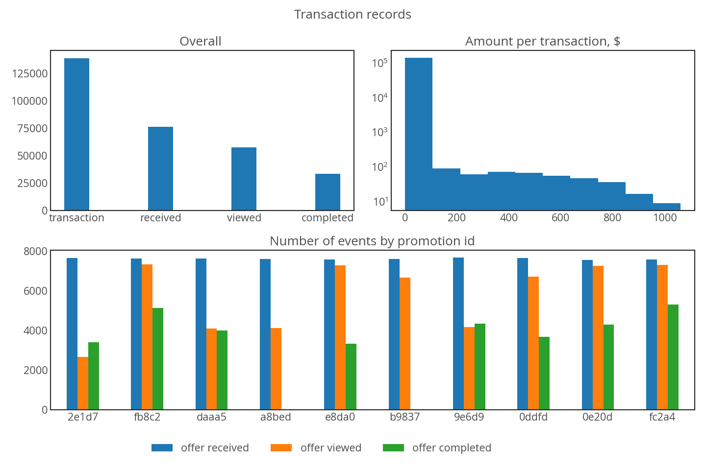
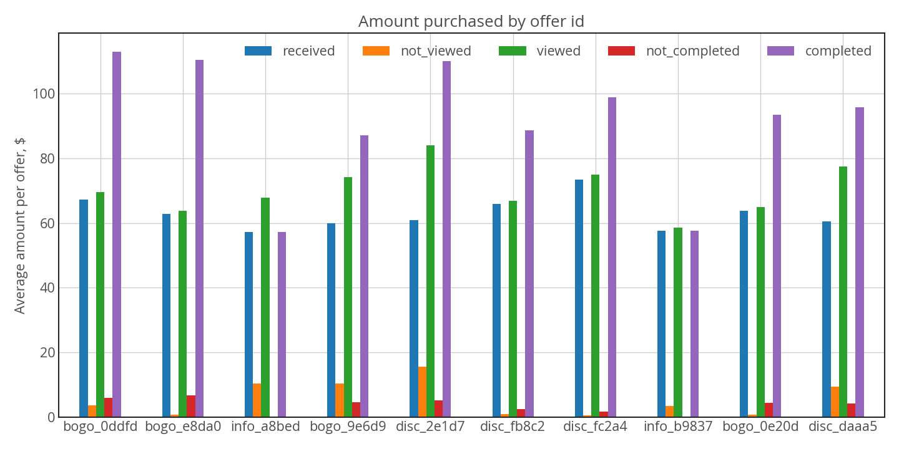

# Starbucks-Promotion-Recommender
analyze simulated data to assess promotion influence on customer and a recommender system based on similar users and the user history preference

# library:
- `pandas`
- `numpy`
- `matplotlib` + `seaborn`

# Data description:
- three json files created by Starbucks. Noted that this is *simulated* data.
- `portfolio.json`: information about offer such as type, difficulty, rewards, valid period
- `profile.json`: user information such as age, income, gender, become membership since
- `transcript.json`: data logs for which offer sent to which person, transaction amount
- `offer_summary.json`: a new arrangement of `transcript.json` to approximate amount spent of each offer based its valid period.

# Data Exploration and Analysis
- Please follow the `Jupyter Notebook` to examine or practice
- counting and distribution of variables in `profile.json`
<p>
  
</p>

- variables in `transcript.json`
<p>
  
</p>

- average of spending amount ($) for each offer. The average amount is calculated for total period of offering avering to those received the offer
<p>
  
</p>

# User Promotion Recommendation
## Aproach:
- if a user is new, the function returns a ranked list of `offer id` and *rate of completion*
- if a user record is existed, 
    - first we find a similar users by `find_similar_users()` and evaluate history purchase by that group by `evaluate_similar_users()` function
    - evaluate that user history preference by `evaluate_user_history()` function
    - combining two ranked lists based on dollar spent and rate of completion by each offer

## Tesing
- existing user:
`user_id = "ddce9ae854314d8cb347db0a7b5db9f8"`
```
# based on both the user and similar users preference, sort by ranking
recommend_offers(user_id=user_id, profile_df=encoded_profile, 
                    info_df=df_info, sort_amount=False)
{'0b1e1539f2cc45b7b9fa7c272da2e1d7': 45.9,
 '5a8bc65990b245e5a138643cd4eb9837': 44.15,
 'ae264e3637204a6fb9bb56bc8210ddfd': 25.07,
 '9b98b8c7a33c4b65b9aebfe6a799e6d9': 23.66,
 '2906b810c7d4411798c6938adc9daaa5': 30.41,
 '2298d6c36e964ae4a3e7e9706d1fb8c2': 28.37,
 'f19421c1d4aa40978ebb69ca19b0e20d': 56.97,
 'fafdcd668e3743c1bb461111dcafc2a4': 21.32,
 '3f207df678b143eea3cee63160fa8bed': 19.28,
 '4d5c57ea9a6940dd891ad53e9dbe8da0': 25.76}                
```
```
# sort by amount spent
recommend_offers(user_id=user_id, profile_df=encoded_profile, 
                    info_df=df_info, sort_amount=True)
{'f19421c1d4aa40978ebb69ca19b0e20d': 56.97,
 '0b1e1539f2cc45b7b9fa7c272da2e1d7': 45.9,
 '5a8bc65990b245e5a138643cd4eb9837': 44.15,
 '2906b810c7d4411798c6938adc9daaa5': 30.41,
 '2298d6c36e964ae4a3e7e9706d1fb8c2': 28.37,
 '4d5c57ea9a6940dd891ad53e9dbe8da0': 25.76,
 'ae264e3637204a6fb9bb56bc8210ddfd': 25.07,
 '9b98b8c7a33c4b65b9aebfe6a799e6d9': 23.66,
 'fafdcd668e3743c1bb461111dcafc2a4': 21.32,
 '3f207df678b143eea3cee63160fa8bed': 19.28}
```
- new user:
```
# new user, this show the rate of completion 
recommend_offers(user_id='new_user')

{'9b98b8c7a33c4b65b9aebfe6a799e6d9': 0.40796808521170025,
 '0b1e1539f2cc45b7b9fa7c272da2e1d7': 0.4272053651235238,
 '2906b810c7d4411798c6938adc9daaa5': 0.48657269740760767,
 'fafdcd668e3743c1bb461111dcafc2a4': 0.492115448802916,
 '2298d6c36e964ae4a3e7e9706d1fb8c2': 0.5261149536044525,
 'f19421c1d4aa40978ebb69ca19b0e20d': 0.6644173774610631,
 'ae264e3637204a6fb9bb56bc8210ddfd': 0.7355425686949739,
 '4d5c57ea9a6940dd891ad53e9dbe8da0': 0.7997686818104269,
 '3f207df678b143eea3cee63160fa8bed': nan,
 '5a8bc65990b245e5a138643cd4eb9837': nan}

```

# Credits:
- Data was given by Starbucks through Udacity's Data Scientist Nanodegree
- StackOverflow for coutless searching


